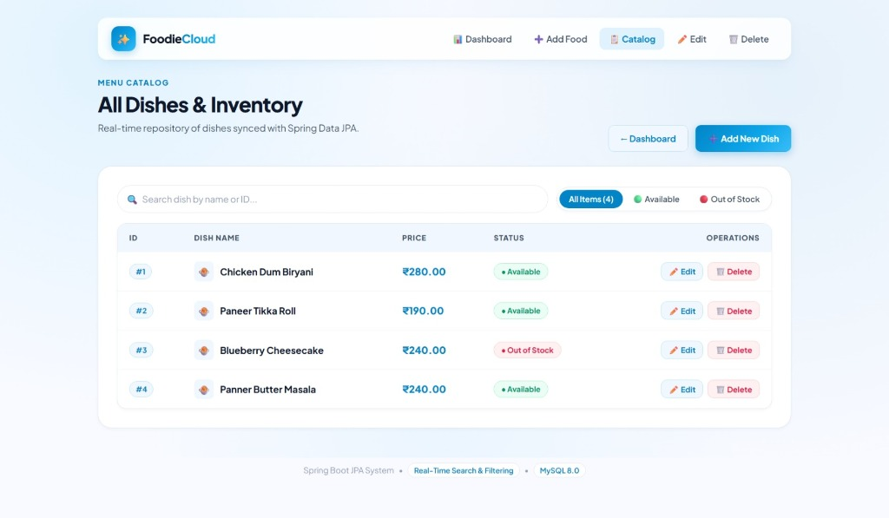
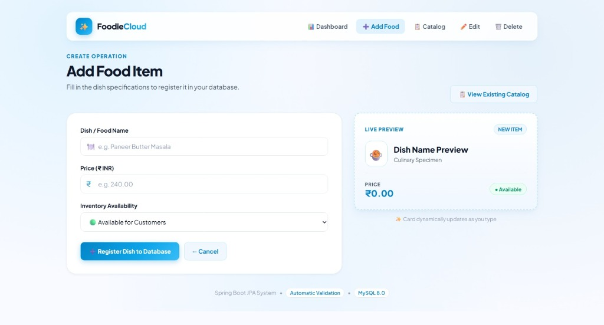
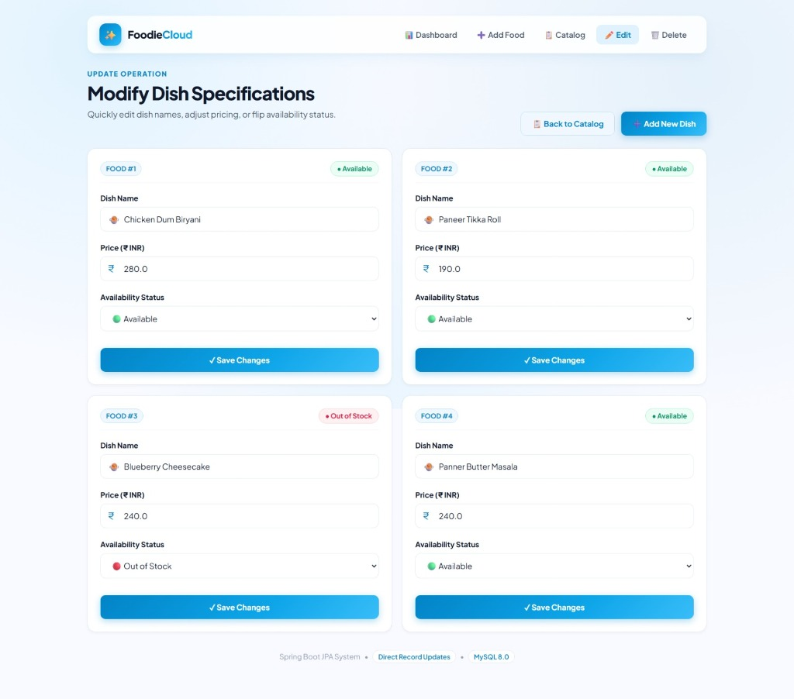
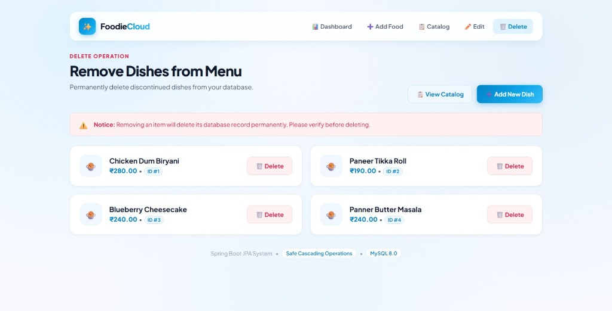
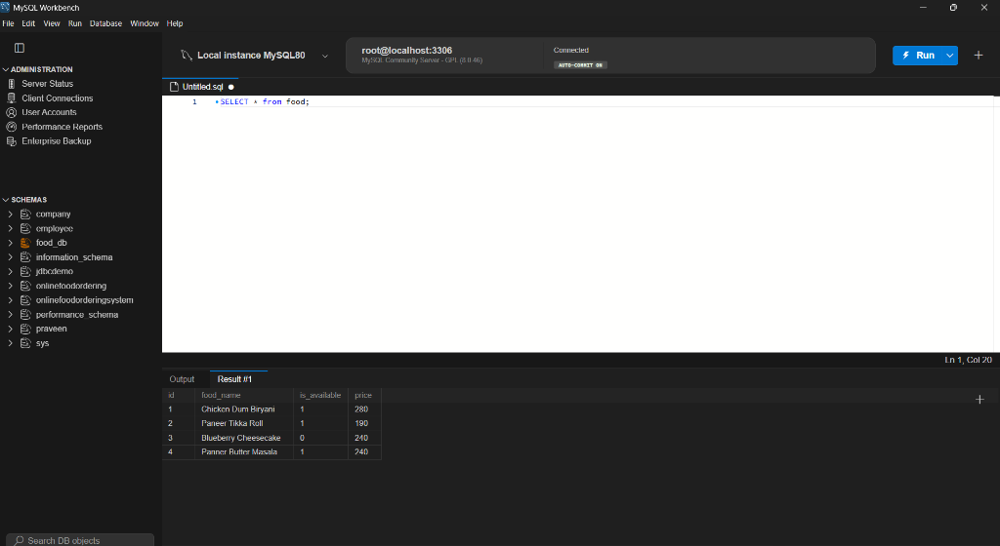

# 🍽️ FoodieCloud - Spring Boot JPA Food Management System

A modern full-stack Java Spring Boot application for comprehensive menu and food inventory management, featuring Spring Data JPA, Hibernate, MySQL 8.0, and a custom **White & Light Blue Accent** responsive UI design system.

---

## 📸 Screenshots & UI Preview

### 1. 📋 Menu Catalog & Real-Time Filtering
Live instant search by name or ID, dynamic filter tabs (**All**, **Available**, **Out of Stock**), and formatted currency pricing.



---

### 2. ➕ Add Food Item with Dynamic Live Preview
Two-column interactive form with a live updating card preview that reflects dish name, price, and availability as you type.



---

### 3. ✏️ Update Dish Specifications
Card-based management grid allowing quick price adjustments, name updates, and inventory toggles directly synced to MySQL.



---

### 4. 🗑️ Safe Deletion Safeguards
Clean card layout with confirmation alerts to prevent accidental record removal.



---

### 5. 🗄️ MySQL Database Schema & Records
Live records verified directly in MySQL Workbench under the `food_db` database.



---

## 🚀 Features

- **CRUD Operations**: Full Create, Read, Update, and Delete capabilities for food dishes.
- **Modern UI / UX**: Custom-tailored design system built with CSS variables, frosted glassmorphism, clean white surfaces, and vibrant sky/cyan-blue accents.
- **Client-Side Live Filter & Search**: Instant filtering across dish names and availability status without page reloads.
- **Real-Time Live Card Preview**: Dynamic preview during creation to see how the item card looks before saving.
- **Spring Data JPA & Hibernate ORM**: Automatic schema creation and update with connection pooling via HikariCP.
- **REST API Support**: Built-in REST endpoints alongside server-rendered Thymeleaf templates.

---

## 🛠️ Technology Stack

- **Backend**: Java 21, Spring Boot 4.1.1
- **Persistence**: Spring Data JPA, Hibernate 7.4, HikariCP
- **Database**: MySQL 8.0
- **Frontend / Templating**: Thymeleaf, Vanilla CSS (Glassmorphism & Light Blue Accent design system), Google Fonts (`Plus Jakarta Sans`)
- **Build Tool**: Apache Maven (with `mvnw` wrapper)

---

## ⚙️ Getting Started

### 1. Database Configuration
1. Ensure MySQL is running on `localhost:3306`.
2. Create the database:
   ```sql
   CREATE DATABASE IF NOT EXISTS food_db;
   ```
3. Update database credentials in `src/main/resources/application.properties`:
   ```properties
   spring.datasource.url=jdbc:mysql://localhost:3306/food_db
   spring.datasource.username=root
   spring.datasource.password=YOUR_PASSWORD
   ```

### 2. Run the Application
Using the Maven wrapper:

**Windows**:
```powershell
.\mvnw.cmd spring-boot:run
```

**macOS / Linux**:
```bash
./mvnw spring-boot:run
```

### 3. Access the Application
Open your browser and navigate to:
- **Dashboard**: [http://localhost:8080/](http://localhost:8080/)
- **Menu Catalog**: [http://localhost:8080/read](http://localhost:8080/read)
- **Add Food**: [http://localhost:8080/create](http://localhost:8080/create)
- **REST API**: [http://localhost:8080/api/orders/getFood](http://localhost:8080/api/orders/getFood)

---

## 👤 Author

Developed by **[praveeng8969](https://github.com/praveeng8969-cmd)**
